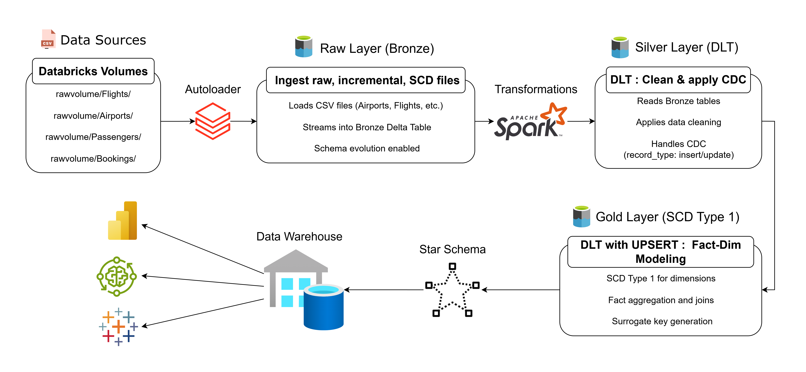

# Enterprise-Grade-Medallion-Architecture-with-CDC-SCD-Type-1

This project demonstrates a modular and dynamic data pipeline built on Azure Databricks, using the Medallion Architecture (Bronze → Silver → Gold). It supports ingestion of raw, incremental, and SCD Type 1 data, featuring streaming with Auto Loader, Delta Live Tables (DLT) for transformations, Change Data Capture (CDC) handling, and surrogate key generation.

## 📊 Data Pipeline Flow



# 🧠 Project Highlights:

- Modular Medallion Architecture: Structured the pipeline into Bronze, Silver, and Gold layers for clean separation of raw, refined, and curated data.

- Dynamic Streaming Ingestion: Used Databricks Auto Loader and parameterized notebooks for schema evolution–resilient streaming ingestion from Volumes.

- Delta Live Tables (DLT): Implemented transformation logic using DLT to standardize and validate data before loading into Silver and Gold layers.

- CDC & SCD Type 1 Handling: Handled record updates using merge-based UPSERT logic for Slowly Changing Dimensions (SCD Type 1).

- Surrogate Key Generation: Created consistent and trackable surrogate keys using hashing techniques to support dimensional modeling.

- Production-Ready Design: Parameter-driven, restart-safe, and scalable pipeline architecture for enterprise-grade workloads.


# ⚙️ Tech Stack & Tools

PySpark | SQL | Delta Lake | Auto Loader | Delta Live Tables (DLT) | Structured Streaming | Databricks Volumes | Unity Catalog | ETL | CDC | SCD Type 1 | Surrogate Keys | Data Modeling | Data Architecture (Medallion) | Azure Databricks | Git | Draw.io

# 🗂️ Folder Structure

  ```
📁 rawvolume/
├── 📁 Airports/
│   ├── raw.csv               
│   ├── incremental.csv       
│   └── scd.csv               
├── 📁 Flights/
│   ├── raw.csv
│   ├── incremental.csv
│   └── scd.csv
├── 📁 Customers/
│   ├── raw.csv
│   ├── incremental.csv
│   └── scd.csv
└── 📁 Bookings/
    ├── raw.csv
    ├── incremental.csv
    └── scd.csv
```

Each folder contains:

  - raw.csv → Historical data
  - incremental.csv → New incoming records
  - scd.csv → Records with updated dimensions for SCD1 handling
  

# 🔧 Key Features

- Modular Bronze Ingestion: Auto Loader-based streaming pipeline, dynamically parameterized by folder/table name.

- Silver Layer with CDC and SCD Type 1: Handles Change Data Capture and dimension updates using merge logic.

- Gold Aggregation Layer: Business-level aggregations such as booking count per customer or airport flight stats.

- Dynamic Checkpointing: Ensures fault-tolerance and exactly-once processing.

- Surrogate Key Generation: Adds artificial keys for dimensional modeling using hash functions.

- Schema Evolution: Supports dynamic schemas using rescue mode.

# 📝 How to Use

- Clone this repository to your local machine or Databricks repo.

- Create a Volume (rawvolume) and upload data into subfolders: Airports, Flights, Customers, and Bookings.

- Attach notebooks to a cluster using DBR 13.x+ with Unity Catalog enabled.

   - Execute in sequence:
    
   - 01_Bronze_AutoLoader.py
    
   - 02_Silver_DLT.py
    
   - 03_Gold_DLT_CDC.py

- Monitor output in respective bronzevolume, silvervolume, and goldvolume folders

# 📊 Sample Output (Gold Layer)

| Booking\_ID | Customer\_SK | Flight\_SK | Booking\_Date | Status    |
| ----------- | ------------ | ---------- | ------------- | --------- |
| BK001       | 101          | 203        | 2024-01-01    | Confirmed |
| BK002       | 102          | 204        | 2024-01-02    | Cancelled |

# 📌 Key Learnings

- End-to-end streaming pipeline design using Databricks

- Importance of schema evolution handling

- Real-world SCD implementation using UPSERTs

- Power of Delta Live Tables for declarative pipelines
